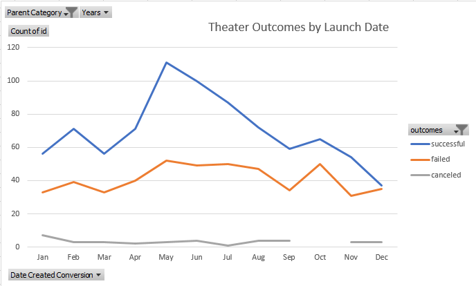
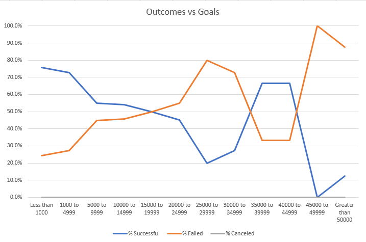

# Kickstarter Analysis of Plays Relative to Their Goal and Launch Date

## Project Overview

This analysis was performed to determine and illustrate the performance of Kickstarter-funded plays based on their goal amounts and launch dates. From this information, we could arrive at an optimal goal and launch date for a future play to maximize its chances of success.

## Analysis & Challenges

### Campaign Success vs Launch Date

In order to arrive at a conclusion, we had to take a spreadsheet of raw data and organize it in ways that would be easily digestible and illustrative. First, we needed to add a column to the data set to reformat the launch dates into years so that we may drill down to specific years if the analysis dictates that. From there, we could pivot the data to organize it in a way where we can easily see how many plays were launched over the duration of the collected data, and their outcomes. We could then graph that pivot table data into a line graph to physically see which months have more successful, or unsuccessful, campaigns. 

### Campiagn Success vs Goal Amount

The other way we wanted to view this data was in terms of each campaign’s goal amount and how it corresponds to the plays’ successes or failures. In order to do so, we created a new sheet to group the plays into goal amount ranges and wrote “countifs” formulas to aggregate how many plays were successful, failed or canceled for each goal range. From there, we took the percentage that each outcome made up of the total for that goal range and graphed those figures. 

### Challenges

Some challenges that could be faced in performing this analysis stem from the beginning. You need to know what points of data that you want to try and analyze, and what effect that could have on the campaigns’ success. For example, choosing goal amount and launch date are only two points of data within the data set. If you chose other figures to plot, those may (or may not) be as intuitive as the ones chosen here. Furthermore, not putting the correct fields in pivot tables or charts may not provide the correct context or information desired. Knowledge of formulas like “countifs” is also necessary because otherwise it could be a tedious process of trying to count how many plays fell into each grouping, with much more room for error. Finally, choosing the right ways to look at the data may not always be the most impactful or tell the proper story. If we made our goal ranges too large, or too small, it may be misleading due to too many results leveling out each group, or not enough results with some outliers skewing the real correlations.

## Results

### Correlation Between Kickstarter Play Success and Launch Date

Judging by the line graph we created, it would appear as though campaigns that begin in May and June have the most successful campaigns. There was a spike in successful Kickstarter plays during those months, without a corresponding proportional spike in failures, thus allowing us to draw the conclusion that these months provide the best chances for success. The graph also illustrates that December is the worst launch month for plays because the number of successes is almost equal to the number of failures in this month, which is the only month where it is even close. 

### Correlation Between Kickstarter Play Success and Goal Amount

When it comes to the campaign goal amount, it shows that the plays with small goals (especially less than $10,000) have a much higher rate of failure than those with larger goals. Plays with a goal of less than $5,000 had a greater than 70% chance of failure, whereas those with a goal of more than $45,000 had an over 80% success rate.

